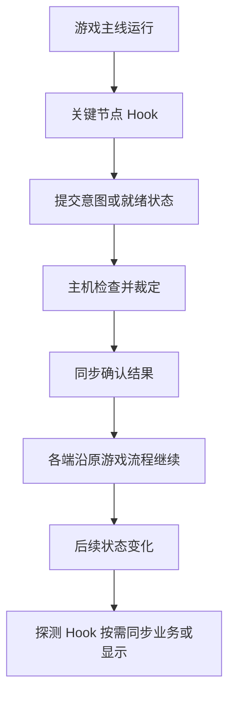

# 营业联机开发方法：沿游戏主线同步状态演进

先梳理游戏主线，在关键节点用 Hook 控制推进，由主机裁定共享状态如何演进；再沿主线布置必要的状态探测 Hook，把其他端需要的变化同步过去，驱动当地业务和显示。代码应围绕这些直接关系展开，保持简洁直白。

本文依据已有场景切换、选店、备菜和夜间营业代码及对应游戏逆向代码提炼开发方法。示例用于说明思路，不表示所有现有实现都已满足这些原则，也不代表新模式已通过联机实测。

## 1. 先梳理游戏主线

从玩家完成一轮营业的过程开始，阅读逆向代码，追踪实际调用、协程和回调，画出进入、准备、营业、结束、结算与退出的主线。再补上失败、重试、下一轮等分支。

每个阶段只需先弄清四件事：

| 问题 | 要找到的依据 |
| --- | --- |
| 怎样进入？ | 谁调用入口，带入什么配置和上下文 |
| 期间发生什么？ | 谁产生共享状态，谁读取和改变它 |
| 何时结束？ | 哪个条件或回调真正表示业务完成 |
| 怎样继续？ | 谁触发下一步，途中还有哪些清理和结算 |

沿调用链理解“为什么走到这里”，才能决定 Hook 应放在哪里。场景名称、面板关闭和方法返回都只是线索；异步工作可能还在继续，同一场景内也可能有多轮营业。

例如，普通营业从打烊到结果界面之间，还要停止刷客、等待顾客离场并结算。新模式应先找到自己的完整结束链，再决定如何同步结束。

这一阶段的产出是一条有代码依据的流程，以及少量关键状态。无需先为整个游戏建立一套新的状态机。

## 2. 在关键节点控制主线推进

主线中会改变共同进程的节点，应由主机裁定。例如确认地图、结束准备、开始下一轮、判定胜负或结束营业。

通用过程是：玩家操作或游戏事件到达节点，Hook 收集所需信息；主机检查当前状态和推进条件，确定结果后通知其他端；各端应用结果，从原游戏入口继续。



这里需要明确两个区别：

- **提交意图与确认结果。** 客机点击按钮，只能说明它想执行某个动作；是否能改变共享状态，由主机决定。
- **获准推进与推进完成。** 收到开始指令后，加载、动画或开场事件仍可能未完成。只有后续逻辑依赖全员完成时，才增加相应的完成确认。

现有选店提供了一个简单例子：各玩家报告选择，主机检查全员一致后确认，随后各端继续原选店流程。可借鉴的是这个职责划分；新模式的裁定规则应根据玩法确定，不必沿用“全员一致”。

主机也应从相应业务入口继续。不要把主机裁定写成一套营业流程，再让客机维护另一套效果相似的流程。

## 3. 沿主线用 Hook 探测状态变化

主线统一后，再看运行期间哪些变化需要被其他端知道。Hook 可以作为状态探测器：在变化发生的位置读取对象、参数或结果，按需产生同步消息。

推进 Hook 负责决定“能否继续”；探测 Hook 负责发现“发生了什么”。二者是职责上的区分，不要求增加两套框架或基类。

选择探测位置时，先确认数据在哪个时点成立：

- 需要读取变化前的状态、截住本地自主行为或调整输入时，考虑 Prefix。
- 需要读取已经产生的结果时，考虑 Postfix，并确认原方法确实执行成功。
- 结果在协程、动画或回调中才产生时，追踪到真正完成的位置。

例如，探测顾客创建结果，可以同步生成了谁；探测订单生成结果，可以同步实际订单；探测收益变化，可以同步应当应用的变化。只监听显示文本，通常无法判断对应业务是否已经完成。

同一业务可能经过多个嵌套方法。应选一个清晰的消息产生点，避免外层和内层 Hook 为同一次变化重复发包。

## 4. 根据其他端的需要决定同步内容

对每项被探测到的变化，先问：其他端收到它之后，需要做什么？

| 其他端的需要 | 同步思路 |
| --- | --- |
| 参与后续业务判断 | 应用确定的共享结果，保证后续逻辑读到正确状态 |
| 执行相同的确定性操作 | 在前置状态一致、没有重复裁定风险时，重放操作及参数 |
| 展示远端玩家或事件 | 更新对应对象和显示，避免顺带重复计算收益等业务 |
| 在阶段边界统一配置 | 按需要下发该阶段的完整结果，再继续主线 |

随机结果和竞争结果应先由主机确定。例如多人同时上菜，必须先裁定是否接受，再让其他端应用结果。只有展示需求的状态，则可以由拥有该状态的玩家直接报告，不必让主机重复计算。

客户端仍可运行必要的动画、移动和界面逻辑。需要拦住的是会与主机产生分歧的自主业务决定。

消息只携带完成该动作所需的数据和稳定标识。对象、订单或回合可能复用时，再加入能够区分它们的标识，避免旧消息影响新状态。

## 5. 同步落地时保留原流程和正确时序

优先调用已有游戏方法，让原游戏完成状态登记、回调、清理和显示。调用前必须审计副作用：它是否还会随机决策、扣除资源、发放收益或触发其他 Hook？需要保留的照常执行，已经由主机裁定或本地执行过的部分应避免重复。

需要受控重放时可以使用 ReversePatch 或已有放行机制，但要检查内部调用。绕过外层 Hook，不代表内部 Hook 也被绕过；收到同步后再次广播同一变化，会形成回声。

收到消息时，还要确认对象及阶段是否允许执行：

- 只是本地加载或动画尚未完成，可以等待已知条件，并明确何时取消。
- 已经离开对应阶段，或消息属于旧对象、旧回合，应丢弃。
- 操作已经执行，不能再重复推进、扣费或结算。

等待条件必须来自已读懂的游戏逻辑。不要用固定延时、不断重试或捕获异常来掩盖未知时序。网络接收后的游戏操作通过项目已有主线程入口执行，新增等待优先使用协程。

## 6. 代码直接表达同步关系

读代码时，应当容易看见“在哪里发现变化、由谁决定、发出什么、另一端做什么”。通常围绕现有 Patch、Action 和必要的业务状态就能完成：

```text
原游戏入口 → Hook → 主机裁定 → 发送确认 → 接收并继续原流程
原游戏变化 → 探测 Hook → 发送所需数据 → 接收并更新状态或显示
```

- Hook 放在对应游戏类的 Patch 中，直接表达拦截或探测意图。
- Action 明确消息方向和含义，接收后直接调用需要的逻辑。
- 只有跨消息必须保留的状态，才交给管理器或状态机维护。
- 简单调用不增加转发层；多个流程确有共同逻辑时，再提取复用。
- 状态机用于表达真实的状态约束和等待关系，不必覆盖每个方法或 UI 动作。

原游戏已维护的状态，能可靠读取就直接读取。额外记录的联机状态应有明确用途，例如保存各玩家的选择、一次确认是否已处理，或当前等待哪个业务结果。

具体写法遵循 [Harmony Hook](harmony-hook-style.md)、[网络 Action](network-action-style.md)、[线程与调度](threading-and-scheduling.md) 和 [协程](coroutine-style.md) 规范。现有代码可以参考思路，新增代码仍应补齐必要的接收约束，不照搬旧实现的缺漏。

## 7. 按主线逐步开发和验证

先完成最小的一轮主线：能够共同进入、由主机推进、正常结束和退出。随后补充沿途的共享状态及显示，最后覆盖模式分支和竞争情况。每增加一项同步，都检查它对后续主线的影响。

实现前可以用一张小表记录决定，不需要逐项罗列全部字段和函数：

| 游戏节点或变化 | Hook 的作用 | 谁裁定 | 其他端需要做什么 | 完成依据 |
| --- | --- | --- | --- | --- |
| 选择营业地点 | 拦截提交 | 主机 | 应用确认并继续原流程 | 实际配置生效并进入后续阶段 |
| 产生订单 | 探测结果 | 主机 | 建立对应订单并显示 | 后续上菜读取同一订单 |
| 结束营业 | 控制结束入口 | 主机 | 执行该模式原有收尾 | 离场、结算和后续流程完成 |

验证应围绕状态演进：主客机是否作出相同决定，较慢的一端能否正确继续，并发操作是否只产生一次有效结果，退出后是否还会执行旧消息。按钮响应、界面出现和业务完成应分别核对。

游戏行为依据逆向代码审计，实际可调用接口以 Interop DLL 为准。逆向仓库位置见本地 `AGENTS.local.md`；标注 `mimo` 的代码仅供参考，尚未确认的逻辑不能作为实现前提。编译和离线检查只证明各自覆盖的范围，主客机运行效果需另行实测。

### 少量源码参考

- [选店补丁](../src/MetaMystia.Mod/Patches/Common/IzakayaSelectorPanelPatch.cs)：提交选择、主机确认、继续原流程。
- [备菜完成消息](../src/MetaMystia.Mod/Multiplayer/Actions/PrepScene/PrepAllReadyAction.cs)：阶段推进前先统一必要配置。
- [顾客补丁](../src/MetaMystia.Mod/Patches/NightScene/GuestsManagerPatch.cs)与 [GuestFSM](../src/MetaMystia.Mod/Managers/GuestFSM.cs)：探测生命周期变化，按业务状态应用同步。
- [夜间事件补丁](../src/MetaMystia.Mod/Patches/NightScene/NightSceneEventManagerPatch.cs)：约束客机自主变更，捕获主机产生的业务变化。

这些示例对应前期已阅读的游戏选店、备菜、顾客订单及营业结束调用链。新模式仍从它自己的主线开始审计。
