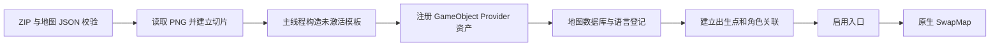

# ResourceEx 白天新地图调研与实践

日期：2026-09-13。目标：新增独立白天地图，以三途川为例，优先解决瓦片、碰撞、图层和切图；快捷传送面板暂缓。

## 结论

**可以从零构造 `DaySceneMap`，不必克隆完整原图，也不必先制作 Unity AssetBundle。** 本次已在运行中的游戏里构造独立色块地图，通过 GameObject Provider 接入原生加载，完成行走、桥面通行、河岸阻挡、前后遮挡、顶层覆盖及两次进出。

建议首版采用：**资源包 ZIP 内的地图 JSON + PNG 图集 → 运行时构造未激活地图模板 → `RuntimeAddressables` 注册 GameObject → 原生 `SwapMap`。** NPC 沿用现有角色配置，碰撞与视觉分开描述。

这是加载方案与结构验证，尚未实现正式 ZIP 地图加载器，也未制作三途川美术。

## 1. 证据范围

| 来源 | 版本 / 内容 | 能证明什么 |
|---|---|---|
| 旧提交 `0d949d50d1456185235e71b41f0b267829af20bc` | `Poc.cs`、`POC-DaySceneMap-Methodology.md`、`POC-NextReverse-Targets.md` | 克隆地图、修改颜色与对象、注入新身份、手动模拟切图的历史实现和记录 |
| 旧提交 `fc647890aac17a31e119ec9555580d0d33d71927` | `ExportTilemap` | 已有瓦片图片导出工具；不是地图序列化与导入器 |
| 本次项目源码 | `5d7631bfd360c50fc751485c18603410ecfecdc3` | 当前 ResourceEx、Provider、角色与网络代码 |
| 本次逆向源码 | `c2ffc7e5f7300de99f1059af5ae0d98cf38a9397` | 原生地图加载、生命周期、输入、排序与出口依赖 |
| 本次游戏实例 | Unity `2021.3.28f1`，MetaMystia `0.27.0`，Il2cppConsoleMod `1.1.0`，Multiplayer Off | 下文明确列出的运行时结果 |
| 已加载资源包 | `ResourceExample` `0.11.0` | 保留现有资源包运行环境；未修改该 ZIP |

本次 Mod DLL 的 SHA-256：`778343AA18E60BC3237A656ED97F91BE19DF78B27788A39A47519FC3620EE8FF`。工作区 HEAD 和 DLL 分别记录，不据此认定二者构建内容完全相同。

逆向仓库位置见不提交的 `AGENTS.local.md`。下文逆向路径均相对该仓库。标注 mimo 或只有空方法体的代码不能单独作确定结论。

### 旧 PoC 需要修正的认识

- 旧 PoC 给 `mapReference` 写 `null`，手动销毁旧地图并更新玩家、UI、音乐，**没有走通标准资源加载**。
- 克隆活体地图需要清理缓存，还可能复制行为、出口、解压器与场景引用；染紫不能证明全新地形和碰撞可用。
- “从零构造几乎不可行”已被本次最小地图实测否定；复杂地图仍需补足其组件依赖。
- 当前逆向的 `SpawnMapReferenceAsync` 是先加载 GameObject 资产句柄，再 `Instantiate(loaded.Component)`，不是旧文档所写的直接 `Addressables.InstantiateAsync`。
- 当前 Interop 可直接访问 `DaySceneLanguage.MapLanguageData`。历史 `s_MapLanguageData` 字段名在本次编译失败，改用属性通过；不应照搬旧反射代码。
- 旧文档中的字典、反射和异步建议只属于历史实验，不覆盖当前项目规范。

## 2. 一张原图实际包含什么

本次初始地图为妖怪兽道 `BeastForest`，玩家位置约 `(11.34,-1.68)`，15 行动点，游戏时间 10:30。

### 瓦片与可视层

| 实际层 | 运行时情况 | 含义 |
|---|---|---|
| `BeastForest_Tilemap_Binary` | 7386 个占用格，`Background/-2000`，Chunk | 主要地面；常见 Sprite 为 48×48、PPU 48、pivot `(0,0)` |
| `Shadow_Floor` | 77 个占用格，`Background/-1300` | 地面阴影，使用专用材质 |
| `Daylight` | 17 个占用格，`Overlay/700` | 光效；样本 PPU 100，格变换含 5 倍缩放 |
| `TopDecoration` | 13 个占用格，`Overlay/5` | 固定盖在角色上方的装饰 |
| `HEIGHT_MAP` | 20 个占用格，Renderer 关闭，纹理可读 | 斜坡输入数据 |
| `MoveColliders` | 0 个占用格，无 TilemapRenderer | 名字像瓦片碰撞层，但实际阻挡由其多边形组件承担 |

Grid 为 Rectangle、XYZ，`cellSize=(1,1,0)`、gap 为零。并非所有层都使用相同 anchor、pivot、PPU 和材质。

`BinaryTilemapDecompressor` 的原图实例配置为 Awake 解压，关联 `Map_BeastForest_Binary`。逆向显示它按 Sprite 索引、图层索引、格坐标和矩阵创建 Tile，再批量 `SetTiles`。**可以用自定义 JSON 构建同样的 Unity Tilemap，无需首版就复刻原版二进制压缩格式。**

当前 `ExportUtils.ExportTilemap` / `ExportTilemapsComposite` 可辅助看图，但其像素合成只取矩阵翻转符号，没有完整重放旋转、缩放、平移与专用 Shader；也不输出碰撞、出生点、NPC 和相机配置。因此导出 PNG 不等于导出了可往返还原的地图。

### 碰撞独立于贴图

妖怪兽道实测存在：

- `MoveColliders` 的 PolygonCollider2D：1 条路径、366 点，参与 Composite。
- `Map` 的 CompositeCollider2D：5 条路径、368 点，`Outlines`。
- 建筑和装饰的独立 Polygon / Box Collider，以及采集、出口的 Trigger。
- `CameraCollider`：单独的 PolygonCollider2D，位于 `Ignore Raycast` 层，供相机使用。

因此视觉 Tile 的 `colliderType=Sprite` **不表示该层已经产生移动碰撞**。首版宜用独立矩形、多边形描述河水、石块和地图外墙，不根据 PNG 透明度自动决定可行走区域。

需要区分：实心障碍多边形、边界轮廓、交互 Trigger、相机中心范围。桥面上的通道宽度还要留出玩家碰撞半径，不能只看图中是否存在空格。

### 图层不是简单的 Z 高度

`DEYU.Utils.LayerSortingController` 按脚底世界 Y 设置 `sortingOrder=(int)(-32*y)`。本次玩家在 `Character` Sorting Layer；实际样本从 Y≈0.89、order=-28 变为 Y≈-0.74、order=23。

建议划分：

| 用途 | 实现 |
|---|---|
| 地面、地面阴影 | Background 的 Tilemap，明确层内顺序 |
| 树、石碑、建筑等需要角色绕前绕后的物体 | 每个物体一个 SpriteRenderer 或 SortingGroup，脚底作排序原点，使用原生 LayerSortingController |
| 树冠、屋檐等固定覆盖物 | Overlay 的 Tilemap / SpriteRenderer |
| 水流、光照、雾 | 后续专门验证材质与动画；不混入静态地面规则 |

不要把所有需要按 Y 遮挡的物体合成一张 Chunk Tilemap，再期待它们逐个与角色交错。一个物体内部可以有多个图层，但组的排序原点应一致。

### HEIGHT_MAP 是斜坡输入，不是楼层系统

`HeightBlendedInputProcessorComponent` 采样当前格 Sprite 的像素：红通道为斜率幅度，绿通道决定正负；一般情况下把输入改为 `(x, y + slope*x)`。剧情和部分向上输入有例外。

本次从零地图 `height=null`，行走成功。故平地、河岸和同一平面上的桥不要求 HEIGHT_MAP；需要横向走斜坡时再加。高度贴图须保持 CPU 可读，且要验证负坐标、格边缘和贴图变换。不能用这个机制直接推导“桥上与桥下同坐标可分别通行”。

### 相机范围与美术覆盖范围

`UpdateCharacter` 将 `map.boundingShape` 交给 CinemachineConfiner。现场 `m_ConfineScreenEdges=false`，约束的是中心；另有 `CinemachineCameraOffset=(0,0.5,-10)` 和像素取整组件。

试验地图美术范围为 `[-18,18]×[-10,10]`，正交相机半高 7.5、半宽 13.3333：

1. 直接使用美术外框作相机范围：左右、上方出现黑边。
2. 按视口半宽高收缩：左侧改善，上方仍多露出半格。
3. 再扣除已观察到的 Y+0.5 偏移，并预留 1/32 单位：该测试位置截图不再露黑边。

最终试验中心范围约为 `[-4.6354,4.6354]×[-2.96875,1.96875]`。这只是当前矩形地图、相机与画幅的实测值；正式加载器应按相机条件计算，并在分辨率、画幅、缩放改变时更新。复杂边界和比视口更小的地图需要单独处理，不能机械套矩形收缩公式。

## 3. 本次实践结果

试验图是从空 GameObject 构建的普通 `DaySceneMap`，没有克隆原地图。地面 36×20 共 720 格，河道 4 格宽，桥面 2 格宽；独立创建 6 个 BoxCollider2D、1 个相机多边形、1 个出生点、1 个按 Y 排序物体与1格顶层遮挡。BGM 沿用初始地图的配置引用。

| 检查 | 结果 | 验证边界 |
|---|---|---|
| GameObject Provider | 注册、原生资产加载成功 | 实验 Provider 只管理一个资产，不是正式多地图注册器 |
| 原生加载预检 | `SpawnMapReferenceAsync` 返回地图和有效句柄；预检实例销毁 | 没有改写原生加载方法 |
| 原生进图 | `_MapAudit_Sanzu`，`IsMapSwapping=false`，玩家出生 `(-6,0)` | 调用 `SwapMap`，0 旅行耗点，禁用本次进图剧情触发 |
| 桥面通行 | `(-6,0) → (5.99,0)`，arrived | 使用游戏移动输入，无坐标跳转 |
| 河水阻挡 | 从 `(6,2.96)` 向 `(-2,3)` 走，停在 `(4.29,2.97)`，blocked | BoxCollider2D 与现有玩家物理碰撞有效 |
| 按 Y 遮挡 | 后方角色被黄色物体盖住；前方角色显示在物体前 | 排序值与帧末截图一致 |
| 固定顶层遮挡 | 洋红格覆盖角色身体 | Overlay 覆盖角色成立 |
| 相机边界 | 复现黑边，按视口和偏移修正后该位置消失 | 未遍历全部边缘、画幅和缩放 |
| 返回与再次进入 | 两次进入试验图、两次返回原图均完成；第二次句柄有效 | 不是长时间循环或泄漏测试 |
| 清理 | 临时地图对象数 0；数据库、地图引用、资产和临时 NPC 图索引均不存在 | 注入的 Provider 类型与脚本定义仍驻留到进程结束，资产已撤销 |

最终回到 `BeastForest`，玩家恢复到约 `(11.34,-1.68)`，行动点仍为 15。最后坐标恢复属于实验清理，不作为行走证据。本次未主动保存、未解锁试验图、未重启游戏；不声称全部业务状态逐项不变。

**本次未验证：** ZIP 地图导入、完整三途川美术、自动出口 Trigger 往返、NPC 新建与对话、斜坡行走、存档重载、包缺失恢复、夜间经营、主客机同步。

## 4. 资源包方案

### 载体选择

| 路线 | 适用范围 | 本次判断 |
|---|---|---|
| 克隆原图再修改 | 快速比较、复用某个复杂组件组合 | 保留为调试手段，不作为全新地形的默认载体 |
| JSON + PNG | 静态瓦片、独立装饰、碰撞、出生点与出口 | 首版采用；运行时构图与原生加载已经验证，ZIP 接入待实现 |
| AssetBundle | 复杂预制体、动画与专用材质 | 可后续研究；还需验证 Unity 版本、Shader、脚本绑定及依赖释放，不能仅凭本次实验承诺可用 |

### 内容约定草案

以下为**待实现字段**，当前加载器不识别 `dayMaps`，不能直接把示例投入现有 ResourceEx 使用。

```text
ResourceEx.json
maps/sanzu.json
textures/sanzu-atlas.png
textures/sanzu-props.png
```

`ResourceEx.json` 可增加地图入口，角色仍放在现有 `characters`：

```json
{
  "packInfo": { "label": "sanzu", "name": "三途川", "version": "0.1.0", "dependencies": ["CORE"] },
  "dayMaps": [
    { "label": "_sanzu_Main", "name": "三途川", "data": "maps/sanzu.json" }
  ]
}
```

地图数据按以下职责组织，第一版限定正交 XY、静态图层：

| 字段 | 必须表达的内容 |
|---|---|
| `formatVersion` | 明确地图数据版本；未知版本拒绝加载 |
| `grid` | 地图原点、cellSize；首版固定 1 单位一格 |
| `tilesets` | 图集 URI、PPU、每块 Sprite 的像素 rect 与归一化 pivot；从现有 RexImageAsset.Texture 切片 |
| `layers` | 标识、用途、Sorting Layer、order、anchor、颜色、稀疏格数据 |
| `cells` | `[x,y,tileId]` 为基础；变换若首版不支持必须拒绝，不能静默忽略 |
| `objects` | 独立装饰 Sprite、坐标、缩放、脚底原点、是否按 Y 排序 |
| `collisions` | `box`、实心 `polygon`、边界 `outline` 分型；点使用明确的地图局部坐标，不与 Trigger 混用 |
| `camera` | 美术覆盖范围、相机策略；计算中心约束时计入画幅和实际相机偏移 |
| `spawnMarkers` | 全局唯一 label、位置、朝向；包括玩家进图点和返回点 |
| `exits` | 自身区域、目标 mapLabel、目标 marker、是否耗 1 行动点、自动/互动触发方式 |
| `height` | 可选；首版可不支持，出现时必须明确报错 |
| `audio` | 明确音乐来源及依赖；首版可沿用一个原图的 BGM 配置，持有对应资产依赖 |

坐标统一为 X 向右、Y 向上。图集 rect 必须约定左下原点；如果编辑器输出左上原点，应在导出时显式换算。首版可固定瓦片 48×48、PPU 48、pivot/anchor 为零，独立装饰允许更大尺寸；不要将这条简化规则误用于所有原版资产。

当前 `RexAssets.CreateImageAsset` 为整张 PNG 创建中心 pivot 的 Sprite。地图不能直接把它当成已经切好的瓦片，需在共享 Texture 上建立切片 Sprite 和 Tile 缓存，避免每格复制纹理。完整地面应由格数据拼出，静态大背景也可作为独立图层，但不能将会与人物交错的物体全部烘焙进去。

### 加载与注册顺序



建议增加 `DayMapConfigs`、`DayMapRegistry`、具体的 `InMemoryGameObjectProvider`，接入现有 `ResourceExManager.MergeResourcePackage`、数据库和语言初始化钩子。不要复制一套 ZIP 扫描器或另一套切图管理器。

登记项包括 `DataBaseDay.mapData`、`mapReference`、`allCollectablesLabels`、`allSpawnMarkerLabels`、`DaySceneLanguage.MapLanguageData`。首版没有采集物、店铺时相应数组/集合为空。`parent` 使用空字符串表示独立区域；不是 `null`，也不是为了省事指向任意原图。

原生加载还会处理目标地图和 `DEFAULT` 的 additive 对象。正式实现应检查这些附加对象是否适用于自定义地图，不应通过手动模拟切图绕过该流程。

特别注意：原生 `SwapMapAsync` 在请求目标资产前已销毁旧地图。故模板、出生点和依赖应在开放入口前验证并准备好；不能让玩家走入出口后才发现 JSON、材质或目标 marker 无效。

### 生命周期

- 模板始终保持未激活，字段、组件和数组全部填好后才允许实例激活，避免 `Awake` 读到不完整配置。
- 模板的 `initialized=false`、`mapLabel=null`、`_Handle=null`，缓存不预先灌入实例对象；原生加载负责实例初始化。
- GameObject Provider 提供模板资产，原生代码负责实例化；不要在 Provider 里返回玩家正在使用的活体地图。
- `DaySceneMap.OnDestroy` 释放其 `_Handle`。包注册器负责共享模板、Tile、Sprite、Texture；不要在一次实例销毁时连共享资产一起删除。
- 依赖原版 BGM、材质或预制体时持有其加载句柄，不能仅保留从临时原图偷取的引用。
- 首版建议包加载后固定到退出游戏，不做运行中热卸载；后续热卸载必须先离开该地图，再撤入口、索引和资产。

### 校验与失败行为

复用现有 ZIP、版本冲突、依赖和 `rex://` 路径规则；mapLabel、marker、出口标识使用包名前缀。`GetMapLabelFromSpawnMarker` 会全局查找第一个含有 marker 的地图，所以 marker 重名不能仅作为警告。

还需校验：切片越界、tileId 缺失、未知 Sorting Layer、非有限坐标、退化/自交多边形、图层/格数/贴图尺寸上限、无效出生点、出口目标缺失。地图构建失败时撤销该地图的临时产物，不启用入口，并记录包名、文件、字段和原因。

地图使用字符串标识，无需强塞入现有数值资源 ID 段；新增角色、料理等仍须遵守 ID 与签名规则。跨包地图引用必须声明依赖，不依赖扫描顺序。

## 5. 角色与互相传送

### NPC

现有 `characters[].spawnMarker` 已有 `mapLabel/x/y/rotation`，可将地图指向 `_sanzu_Main`。例如小町等新增角色应仍通过现有角色、像素动画、对话配置注册，地图数据只负责位置及引用，避免出现两套角色系统。

当前 `SpawnMarkerRegistry.Register` 在地图 `GenerateSpawnMarkerData` 后生成资源包角色点位；`DaySceneMapPatch` 使用角色 label 定位，并克隆临时 `TrackedNPC` 调整定位，不把新 destination 直接写回原记录。注册地图必须先于这些位置处理。

`SpecialGuestRegistry.RegisterNPC` 中仍有注释掉的旧实现，不能仅看该函数判断 NPC 创建链路；需要连同 `RegisterAllSpecialGuests`、原生运行时 NPC 数据、`RefreshAllDayNpcs` 和定位 Patch 一起验收。本次未新增、搬动或验证 NPC 对话。

### 出口，无需先做传送面板

可使用原生组合：

`Collider2D (Trigger)` + `InteractableArea` + `MapTransitionData` + `MapTransitionConditionComponent` + `MapTransitionBehaviourComponent` + `VisualEntity`。

目标由 `targetSceneLabel`、`targetSceneSpawnMarker` 指定，`shouldCostAction` 决定 0/1 行动点；`isInteractTransition` 区分走入与互动。Behaviour 最终调用原生 `SwapMap`。这些组件存在 Awake/Start 依赖，需在未激活对象上完成组装，VisualEntity 与 InteractableArea 的数组也应显式为空或有效，不能只挂行为组件。

推荐先在原图注入一处入口，在新图设置一处返回出口；每次原图实例初始化时按唯一出口 ID 注入，避免重复。进图出生点应在出口触发区之外，防止落地即被传回。

原生条件会检查 `GetMapOpenStatus`，它根据 MapNode.parent 或自身 mapName 查询解锁状态。**直接 `SwapMap` 成功不等于出口已可用。** 正式包需先注册地图，再按约定解锁；`UnlockMap` 还涉及通知与配方，不能当作纯字典登记。本次没有解锁临时地图，所以不把直接往返记作完整门户互动测试。

## 6. 存档与联机边界

地图瓦片与模板属于包资产，应随包加载重建，而不是把 Unity 对象写进存档。解锁与 NPC 状态则进入运行时数据，原生存档包含 `trackedMaps` 与 `trackedNPCs`。不要仅为了登记地图去写 NPC 的持久化 destination。

正式发布前要覆盖：旧存档首次装包、保存后重启、角色刷新、升级包、缺少/禁用包。包缺失时保留可恢复信息，屏蔽无效入口；若恢复流程会引用该地图，必须在进入流程前转到已验证的原版落点，不让原生切图走到销毁旧图后失败。本次未验证完整存档保存/恢复链。

联机不能直接宣称支持：当前 `MoveSyncAction.MapLabel` 使用固定 `MapLabel : ushort`，未知字符串会转为 `Unknown`，两张不同自定义地图会失去区别。以后需要稳定地图键或经握手确认的映射表，并核对包版本/内容；不能让两端按本地加载顺序各自编号。首版可明确限定单机地图实践。

## 7. 分步落地与验收

| 步骤 | 交付 | 通过条件 |
|---|---|---|
| 1. ZIP 到空地图 | JSON/PNG、切片、Tilemap、独立碰撞、相机、GameObject Provider | 用资源包重放本次桥面/河岸/遮挡/相机检查，并正常重复进出 |
| 2. 原图与新图出口 | 入口注入、目标校验、解锁、返回点 | 真正走入或互动往返；未解锁不可进入；不循环触发；耗点符合配置 |
| 3. 一个角色 | 沿用 characters 与 spawnMarker | 能显示、正确遮挡、可互动；离开重进不重复，旧图不残留 |
| 4. 持久化验收 | 旧存档、重启、缺包恢复 | 正常恢复；移除包仍能进入可用原图 |
| 5. 扩大表现 | 完整三途川图集、雾、水流、斜坡 | 分层逐项验收，记录纹理内存与加载时间 |

三途川首张可玩样图只需两岸、一座桥或渡口、一条返回路、一个角色位置。先将完整范围的瓦片、岸线阻挡和遮挡跑通，再扩大地图和装饰。快捷传送面板、夜间店铺、复杂多层通行及联机另立验收，不阻塞第 1 步。

## 8. 复现载荷与源码索引

载荷在 `src/MetaMystia.AITest/`，不参与 Mod 构建；HTTP 调用继续遵守该目录 README 的提权与 Token 规则。定义只初始化一次；游戏/会话改变后重新观察，不复用历史坐标。实验 Provider 是单资产模型，不用于生产。

| 载荷 | 用法 |
|---|---|
| `map-audit-observe.cs` | `/exec` 只读观察当前地图 |
| `map-audit-init.csx` | `/script` 定义；依次调用 `MapAudit.Build()`、玩家宿主 `StartCoroutine(MapAudit.Preflight())`；确认 `Status` 后 `MapAudit.Enter()` |
| `day-nav-init.csx` | 原有移动工具；本次用于桥面与河岸检查 |
| `map-audit-checks.csx` | 仅试验图，执行固定遮挡路线；每段检查实际完成，失败即停 |
| `map-audit-camera.csx` | 仅试验图，修正本次矩形地图的相机中心范围 |
| 清理 | `MapAudit.Leave()`；确认返回完成后 `MapAudit.Cleanup()`，再查地图对象与注册项 |

关键逆向文件：

- `src/Assembly-CSharp/GameData/Core/Collections/DaySceneUtility/DataBaseDay.cs`：地图索引、资产加载、全局 marker 查找。
- `src/Assembly-CSharp/DayScene/SceneManager.cs`、`DaySceneMap.cs`：切图、实例初始化、NPC、退出与句柄。
- `src/Assembly-CSharp/DayScene/Input/DayScenePlayerInputGenerator.cs`：玩家落点、相机与高度输入绑定。
- `src/Assembly-CSharp/Common/CharacterUtility/HeightBlendedInputProcessorComponent.cs`：斜坡采样与输入变化。
- `src/Assembly-CSharp-firstpass/DEYU/Utils/LayerSortingController.cs`：按 Y 排序。
- `src/DEYU.BinaryTilemap/BinaryTilemapDecompressor.cs`：原版瓦片重建。
- `src/Assembly-CSharp/DayScene/Interactables/` 下的 `MapTransitionData`、`InteractableArea`、`VisualEntity` 及相关 Condition / Behaviour：出口与初始化依赖。
- `src/Assembly-CSharp/GameData/RunTime/DaySceneUtility/RunTimeDayScene.cs`：地图解锁、NPC 与存档数据。

项目依据：[资源包约定](resourceex-package-contract.md)、[模块结构](resourceex-module-structure.md)、[RuntimeAddressables](../src/MetaMystia.Mod/ResourceEx/Addressables/RuntimeAddressables.cs)、[SpawnMarkerRegistry](../src/MetaMystia.Mod/ResourceEx/Registries/SpawnMarkerRegistry.cs)、[移动同步](../src/MetaMystia.Mod/Players/PlayerProfile.cs)。
