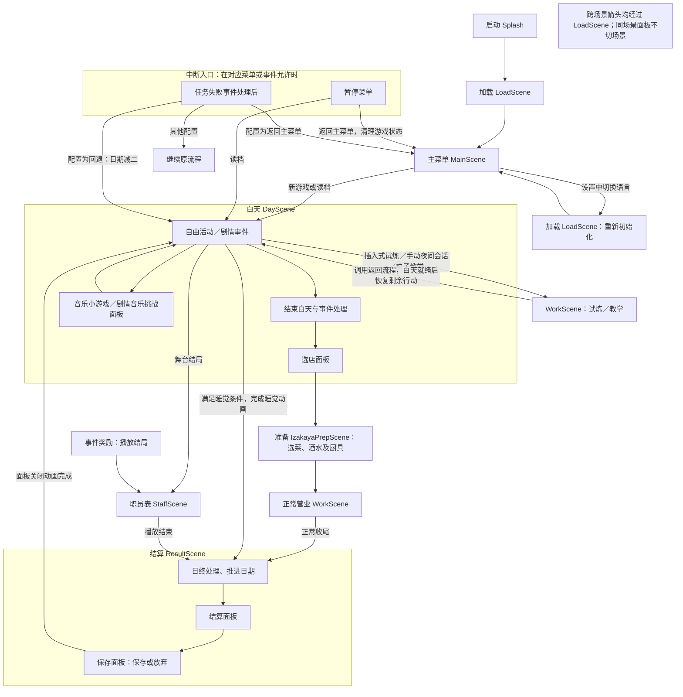

# 场景流转审计

Release 4.4.0e

```mermaid
flowchart TD
    S[启动 Splash] --> L[加载 LoadScene] --> M[主菜单 MainScene]
    M -->|设置中切换语言| LR[加载 LoadScene：重新初始化]
    LR --> M
    M -->|新游戏或读档| D

    subgraph DAY[白天 DayScene]
        D[自由活动／剧情事件] --> E[结束白天与事件处理] --> P[选店面板]
        D --> MU[音乐小游戏／剧情音乐挑战面板]
        MU --> D
    end

    P --> B[准备 IzakayaPrepScene：选菜、酒水及厨具]
    B --> W[正常营业 WorkScene]
    W -->|正常收尾| R
    D -->|满足睡觉条件，完成睡觉动画| R

    subgraph RESULT[结算 ResultScene]
        R[日终处理、推进日期] --> RP[结算面板] --> SP[保存面板：保存或放弃]
    end
    SP -->|面板关闭动画完成| D

    D -->|插入式试炼／手动夜间会话／响子教学| T[WorkScene：试炼／教学]
    T -->|调用返回流程，白天就绪后恢复剩余行动| D

    D -->|舞台结局| C[职员表 StaffScene]
    RE[事件奖励：播放结局] --> C
    C -->|播放结束| R

    subgraph INTERRUPT[中断入口：在对应菜单或事件允许时]
        X[暂停菜单]
        F[任务失败事件处理后]
    end
    X -->|读档| D
    X -->|返回主菜单，清理游戏状态| M
    F -->|配置为返回主菜单| M
    F -->|配置为回退：日期减二| D
    F -->|其他配置| CONT[继续原流程]

    NOTE[跨场景箭头均经过 LoadScene；同场景面板不切场景]
```
