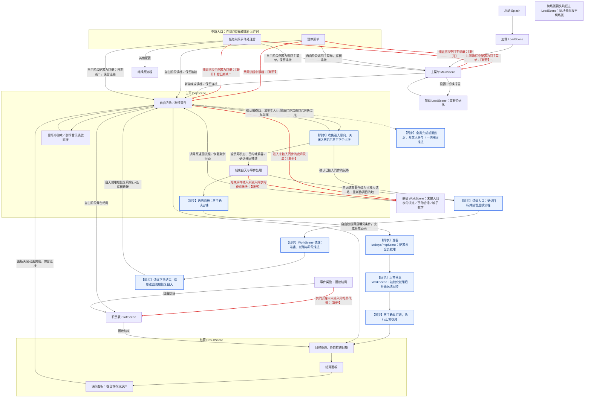

# 场景流转图

Release 4.4.0e

蓝色 **【同步】** 标出模组协调的位置；红色 **【断开】** 路径先断开连接，再执行原游戏操作。常规营业与最终试炼的同步规则见[联机架构](multiplayer-architecture.md)。

```mermaid
flowchart TD
    %% 红色边：按原中断入口执行，不改变游戏目标。
    X -->|共同流程中读档：【断开】| D
    X -->|共同流程中回主菜单：【断开】| M
    F -->|共同流程中配置为回主菜单：【断开】| M
    F -->|共同流程中配置为回退：【断开】后日期减二| D
    D -->|进入未接入同步的夜间玩法：【断开】| U
    RE -->|共同流程中未接入的结局改道：【断开】| C
    E -->|结束事件转入未接入同步的夜间玩法：【断开】| U

    S[启动 Splash] --> L[加载 LoadScene] --> M[主菜单 MainScene]
    M -->|设置中切换语言| LR[加载 LoadScene：重新初始化]
    LR --> M
    M -->|新游戏或读档，保留连接| D

    subgraph DAY[白天 DayScene]
        D[自由活动／剧情事件] --> EN[【同步】收集进入意向、关闭入房后由房主下令执行]
        EN -->|全员可参加、目的地兼容，确认共同推进| E[结束白天与事件处理]
        EN -->|确认前撤回，清除本人意向与就绪| D
        E --> P[【同步】选店面板：房主确认店铺]
        D --> MU[音乐小游戏／剧情音乐挑战面板]
        MU --> D
    end

    P --> B[【同步】准备 IzakayaPrepScene：配置与全员就绪]
    B --> W[【同步】正常营业 WorkScene：初始化就绪后开始玩法同步]
    W --> CL[【同步】房主确认打烊，执行正常收尾]
    CL --> R
    D -->|自由阶段满足睡觉条件，完成睡觉动画| R

    subgraph RESULT[结算 ResultScene]
        R[日终处理、各自推进日期] --> RP[结算面板] --> SP[保存面板：各自保存或放弃]
    end
    SP -->|面板关闭动画完成，保留连接| D

    EN -->|确认已接入同步的试炼| ST[【同步】试炼入口：确认目标并接管后续流程]
    E -->|白天结束事件改为已接入试炼：重新协调目的地| ST
    ST --> T[【同步】WorkScene 试炼：准备、就绪与阶段推进]
    T --> TR[【同步】试炼正常结束，沿原返回流程恢复白天]
    TR -->|白天就绪后恢复剩余行动，保留连接| D
    U[单机 WorkScene：未接入同步的试炼／手动会话／响子教学]
    U -->|调用原返回流程，恢复剩余行动| D

    D -->|自由阶段舞台结局| C[职员表 StaffScene]
    RE[事件奖励：播放结局] -->|自由阶段| C
    C -->|播放结束| R

    subgraph INTERRUPT[中断入口：在对应菜单或事件允许时]
        X[暂停菜单]
        F[任务失败事件处理后]
    end
    X -->|自由阶段读档，保留连接| D
    X -->|自由阶段返回主菜单，保留连接| M
    F -->|自由阶段配置为返回主菜单，保留连接| M
    F -->|自由阶段配置为回退：日期减二，保留连接| D
    F -->|其他配置| CONT[继续原流程]

    D -.->|共同流程正常返回后报告完成| DONE[【同步】全员完成或退出后，开放入房与下一次共同推进]

    NOTE[跨场景箭头均经过 LoadScene；同场景面板不切场景]

    classDef sync fill:#e8f1ff,stroke:#2563eb,color:#163b75,stroke-width:2px;
    class EN,P,B,W,CL,ST,T,TR,DONE sync;
    linkStyle 0,1,2,3,4,5,6 stroke:#dc2626,color:#b91c1c,stroke-width:2px;
```
