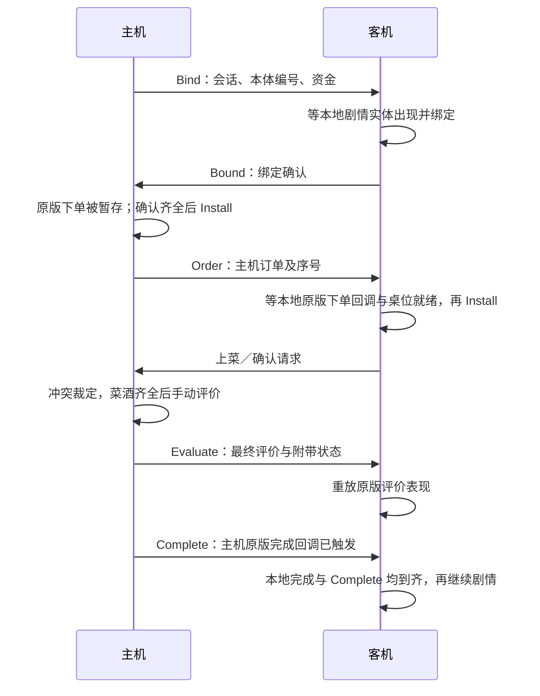

# 幽幽子挑战同步审计

适用：`Story_Yuyuko`、`Challenge_Yuyuko`，游戏 4.4.0e。逻辑依据为当前版本 IDA 数据库，吞厨具路径另与 4.3.0c 数据库比对；调用接口以项目实际引用的 Interop DLL 为准。

## 本体为什么没有进入同步

```text
NS_MGuest_MVT_Spawn_Behaviour
  → NightSceneDirector.SpawnManualControlledSpecialGuest
  → GuestsManager.SpawnManualControlledSpecialGuestGroup
  → SpecialGuestsController（GuestSpawnType.Manual）
  → controlledGuest["Yuyuko"]
```

这条路径没有调用 `PostInitializeGuestGroup`，因此绕过了普通顾客的 `GuestFSM.OnSpawn`。本体的入座、点单、评价和离场也由剧情手动调用，不能仅补发普通出生消息。

## 同步边界

| 环节 | Hook / 处理 | 主客机分工 |
| --- | --- | --- |
| 本体生成 | `SpawnManualControlledSpecialGuest`、`GetControlled` | 给两端原有实体绑定同一个 RuntimeId；绑定确认后主机才安装订单，支持晚进场景补发绑定 |
| 手动点单 | `SetManualControllerOrderInternal` | 主机确定料理、酒水或标签；客机保留自己的原版完成回调，等待对应订单 |
| 上菜、撤回、确认 | 现有 `ServeSellableAction`、`ConfirmServeAction` | 复用主机冲突裁定，订单使用独立递增序号；未来订单消息等待，过期消息丢弃 |
| 手动评价 | `EvaulateManualOrder`、本体改判回调、`PostEvaluation` | 主机决定最终评价、心情、连击保护、覆盖台词和倍率；客机重放表现，跳过重复扣血和吞食判定 |
| 评价完成 | 包装原版 `onEvaluate` | 客机必须同时收到主机完成消息且本地异步评价完成，才继续原版订单循环 |
| 三阶段分身 | `Phase3GuestSpawnLoop\|43.MoveNext` | 只让主机运行生成及专用回调安装；客机等待现有普通顾客消息，避免禁止生成后继续访问空对象 |
| 吞厨具 | `LockCookersYuyuko\|41.MoveNext` | 主机选索引；客机在原协程 state 1 安装该目标和特效，state 2/3 仍执行原版中断、锁定、隐藏和清理登记 |
| 烹饪消息 | `Extract`、`SetCook`、`StartCookCountDown` | 抑制吞食内部重复取菜广播；已锁厨具拒绝迟到的烹饪、QTE 消息 |
| 阶段结束 | `Timing\|2`、主循环恢复点 | 一阶段由主机清场结账后广播最终营业额；客机等待消息并回填依据，再运行原版判定与收尾 |
| 清理、离场 | `CleanOrderInfo`、`SetManualControlledLeave`、`OnBuffEnd\|42`、场景 Dispose | 废弃旧订单回调；只移除本次吞食登记的锁与特效，包括尚未登记原版收尾回调时被中断的情况 |

主循环恢复点：`4` 为一阶段计时结束，`9` 为二阶段计时结束，`10` 为二阶段等待符卡执行完后的判定，`15/16` 分别为剧情版/挑战版三阶段结束。客机可以保留本地倒计时显示，但不能据此先行判定结果。

核心实现位于 `Managers/YuyukoGuestSync.cs`、`Managers/YuyukoGuestSync.Challenge.cs` 和 `Managers/GuestFSM.Manual.cs`（相对 `src/MetaMystia.Mod/`）。生命值与失败消息沿用现有实现，现有阶段准备和联机规则保持原有配置。

## 维护时先区分的三种状态

| 状态 | 来源 | 用途 |
| --- | --- | --- |
| 顾客状态 | `GuestFSM.CurrentState` | 本体是否等待上菜、正在评价或交回剧情控制 |
| 订单身份 | `manualOrderSeq` | 主机分配的递增序号，不等于客机实际安装过的订单数量 |
| 原版协程位置 | `__1__state` | 原方法在等待结束后从哪一段继续；数字依赖游戏版本，不是挑战阶段编号 |

`BindManual` 给剧情已有对象建立顾客状态机和网络映射，不创建第二个幽幽子。阶段消息复用本体消息格式，因此也依赖已建立的网络身份；阶段判定本身使用的是原版挑战上下文。

## 订单与评价的完整时序



上菜可由任一玩家发起，图中仅以客机请求为例。主机自己的剧情在主机原版完成回调后继续，不等待客机完成确认；客机则同时等待主机通知和本地表现完成。

### 为什么需要逐帧处理

网络接收和原版剧情各自推进。订单消息可能先到，但客机尚未走到下单回调，不能立即安装。`Process` 在主线程每帧重试：先尝试绑定，剧情外处理吞食和取消，再安装或应用订单，最后检查评价完成；客机每帧最多消费一条普通事件。

这与 TCP 有序性不冲突：`YuyukoGuestSync.incoming` 保存订单和评价事件，`GuestFSM` 的队列保存上菜操作，两套队列的执行条件不同。第三单消息已经收到但尚未安装时，第三单上菜消息仍需等待。旧序号消息丢弃；同序号但已结束等待上菜的消息也不再应用。

幽幽子的上菜消息可在剧情期间接收，但状态机暂停执行，剧情结束后才继续处理。普通顾客仍使用原有剧情丢弃规则。

### 回调与取消

| 字段／方法 | 含义 |
| --- | --- |
| `pendingCallback` | 本地原版为下一张手动订单准备的剧情回调 |
| `orderCallback` | 当前已安装订单的原剧情回调；恢复剧情前先清空引用，避免重复调用 |
| `wrappedCallback` | 传回原版的包装回调，将真正完成通知给同步管理器 |
| `localCompleted` / `hostCompleted` | 本地原版评价完成／主机完成通知；允许任意先后顺序 |
| `lifetime` | 本体同步生命周期；重置后旧协程及回调失效 |
| `orderVersion` | 订单安装或取消时变化；防止已取消订单的晚到回调生效 |

`PostEvaluation` 的方法返回不等于异步表现完成，因此本体不用普通顾客 Postfix 直接推进状态。`installing` 和 `replayEvaluation` 仅包围同步调用，用于放行自己的 Hook 或替代计算；异步结束另由包装回调跟踪。

阶段取消走 `Clear`，优先于尚未安装的订单。客机可以直接接受取消序号，而不必先补装被取消的订单。例如第三单尚未安装便被取消，客机记下第三号已取消，下一单可以接第四号。取消会废弃回调，不模拟正常评价完成。

断线且仍在挑战场景时，待安装订单或已经完成的回调交回原版；尚在运行的评价在完成时继续原剧情。场景重置则移除网络映射，并通过生命周期编号隔离旧回调。

## 阶段和吞厨具的 Hook 配合

`YuyukoTimingPatch` 保留客机本地计时显示：本地先结束则等待主机消息，主机消息先到则结束本地计时。`YuyukoMainLoopPatch` 随后在对应恢复位置回填主机数据，再放行原版判定。第一阶段例外在广播时机：主机 state 4 内先清场结账，再判断营业额，Postfix 确认进入失败等待 5 或成功剧情等待 6 后才广播；不能在 Prefix 发送清场前金额。其他阶段保留原有广播时点。主循环补丁返回的 `SkipOriginal` 只暂停本次执行，配合 `__result = true` 保持协程存活；计时补丁的 `__result = false` 则表示计时协程结束。

第一阶段修复已通过 Release 编译和离线协议检查，其中新增 8 项覆盖清场后广播、失败结果放行、重复消息和收入回填。用户随后反馈原双端复现场景重测通过；此结果不扩展为完整挑战流程均已验证。

| 吞食协程位置 | 原版职责 | 联机处理 |
| --- | --- | --- |
| 0 | 开始吞食流程并准备局部上下文 | 使用原版；客机须为已登记的主机事件 |
| 1 | 随机选择目标、建立特效并等待移动 | 主机正常选择并广播；客机替换为主机目标，同时保留原版初始化 |
| 2 | 中断烹饪、登记厨具锁、隐藏厨具并等待震动 | 使用原版；内部 Extract 不再作为玩家取菜广播 |
| 3 | 隐藏特效并登记效果结束时的解锁回调 | 使用原版；阶段收尾另覆盖尚未完成登记的锁 |

客机初始化使用的 `(10, -9.5, 0)` 和 `0.5` 秒来自 4.4.0e 原版 state 1。`AfterSwallowStep` 不仅清除临时标记，还在主机从 1 到 2 时广播选中的目标。`EndPhase3` 只移除本次吞食的锁与特效，不清空其他符卡的锁；原版协程句柄仍登记到原挑战上下文，由原版停止。

联机补丁使 QTE 期间时间继续推进，已开始的 QTE 可能在厨具被吞后才完成。`StartCookCountDown` 本身没有锁定检查，因此本地入口和网络 QTE 重放入口都需拒绝已吞厨具。该先后关系有源码依据，尚未在双端游戏中复现验证。

## 文件组织与审阅入口

- `Managers/YuyukoGuestSync.cs`：绑定、订单、评价与回调生命周期。
- `Managers/YuyukoGuestSync.Challenge.cs`：阶段数据、吞食重放和收尾；与上一个文件属于同一个类。
- `Patches/NightScene/GuestsManagerPatch.cs`：同一原版管理类的手动订单、评价、清理和离场 Hook。
- `Multiplayer/Actions/WorkScene/YuyukoGuestAction.cs`：主机权威事件。
- `Multiplayer/Actions/WorkScene/YuyukoGuestBoundAction.cs`：客机绑定确认及补发请求。
- `Multiplayer/Actions/WorkScene/YuyukoGuestEvent.cs`：事件枚举，数值顺序属于协议。

以上路径相对 `src/MetaMystia.Mod/`。编译器生成类型和状态编号的解释见对应方法 XML 注释。游戏版本变化时，需要重新核对这些映射及调用时序；能通过 Interop 编译不足以证明行为兼容。

## 版本与还原代码的差异

游戏目标版本统一配置在根目录 `Versions.props` 的 `TargetGameVersion`，模组项目据此生成运行时版本字符串和编译宏，如 `RELEASE 4.4.0e` 对应 `TMI_RELEASE_4_4_0E`。

依赖协程状态、闭包类型和生成回调的文件使用 `#if !TMI_RELEASE_4_4_0E` 与 `#error` 标记。升级目标版本后，这些文件会直接编译报错；逐个核对新版本行为与 Interop 接口后，再更新对应文件的标记，不要保留旧宏绕过检查。

- 4.4.0e 挑战分支使用 `__c__DisplayClass16_6`；4.3.0c 对应 `_5`，局部函数编号随之变化。不能照抄旧闭包名称。
- 当前吞厨具明确写入 `EventManager.LockedCookersRaw`（字段偏移 `0x280`）；旧还原 C# 中的 `ExiledGuestIndexes` 不能作为实现依据。
- 当前挑战本体循环仍随机选择普通订单或标签订单，并单独等待 `orderCanContinue`。旧还原代码中不完整的挑战分支不足以说明完整链路。
- 当前 `SetManualControllerOrderInternal` 只将耐心上限设为 100 并刷新满格显示，不重置 `CurrentPatient`；旧还原 C# 的 `SetManualControlledPatient(..., 100)` 与此不同。耐心倍率仅用于 `AddToPatientCountdown` 初始化的倒计时，不用于手动订单。
- 剧情版改判回调 `YuyukoOverrideEvaluationCallback\|33` 强制保护连击，按菜酒等级设置倍率，特殊情况下返回 `Null`；挑战版 `\|50` 保留评价，再扣血或触发吞食。两者分别处理。

## 验证范围

- 已通过 4.4.0e Interop 的 Debug、Release 编译；使用隔离输出目录，没有安装到游戏。
- 同步管理器离线协议夹具通过 30 项检查，覆盖绑定先后、剧情缓存、异步完成、重复消息、旧回调失效、阶段判定、吞食目标、中断清理和断线回调。
- 已离线检查 22 个新增及相关 Hook 的目标方法、参数名和类型，未执行游戏程序集。
- 已通过双端调试接口检查一次本体续单故障，见下文；尚未完成修复后的完整流程实测。仍需验证本体双方上菜、分身差评吞厨具、厨具正在烹饪时被吞、阶段结束与吞食重叠、剧情播放速度不同的完整通关和失败流程。

协议要求双方使用相同版本的 Mod。断线时交回原版订单回调；本次没有增加营业中重连或中途加入能力。

### 手动订单续单中断

主机运行日志显示：前两次本体订单安装将旧耐心从 -1 放大到 -3、再到 -9；第二单评价及完成消息已发送，下一次安装在耐心显示更新处触发数组越界，异常位于 `Process → Install` 调用链。订单安装先于广播，因此主机可能已有新订单，而客机仍停在旧单。

当前二进制核对确认：手动安装没有重置实际耐心；耐心回调使用 `100 * CurrentPatient / MaxPatient`，显示端以该百分比选择精灵。修正为移除手动安装后的倍率 Hook，保留普通倒计时的倍率处理。后续双端日志确认第三单已发送并安装，耐心为 -1 / 100；桌面仍有下述独立问题。首次黑评是否异常需单独核对订单要求与实际上菜。

### 投掷上菜后的桌面残留

双端日志与客机调试快照确认：第二单黑评后，客机在 04:23:23.262 已安装第三单，但旧上菜流程在 04:23:24.193 再次尝试评价。第三单菜酒数据均为空，桌面料理贴图仍为第二单的 11000（山泉双色果盘）。本次没有漏收第三单。

原版 `OnThrowDelivering` 保存打开面板时的订单和回调；投掷结束后先回写桌面贴图，再执行订单更新。联机确认在动画结束前即可触发主机评价和续单，因此旧投掷可能在新订单清桌之后恢复贴图。该时序不限于黑评。

`WorkSceneSustainedPannelPatch.OpenServePanel_Prefix` 为本体的料理、酒水显示及评价回调检查订单身份、序号与等待上菜状态；订单结束或替换后拒绝旧回调，断线后仍允许当前订单交回原版。投掷动画本身不变。

Release 编译和 9 项离线回调检查通过。客机独立载荷验证了已结束订单的三个回调均未执行；载荷以已确认的本体指针替代内部身份入口，仅验证委托调用与拦截条件，没有安装 Hook 或改写现场。修复后的完整投掷、黑评、续单和桌面清理仍待双端重放验证。
