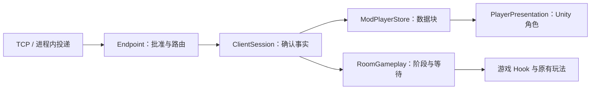

# 联机重构记录

状态：已从当前主线落地重构，参考废弃分支 `wip/server@6a6d140`。本次直接替换旧框架，不兼容旧版联机协议，参与者需要同步更新。

## 已确认的边界

- 服务器负责连接、握手、建房、入房审批、成员、踢人、解散和转发；游戏逻辑由房主运行。
- 独立服务器握手完成即进入公共域；入房增加玩法关系，公共聊天和白天玩家展示继续可用。
- 直连端点的玩家在握手时直接分配进默认房间，不另行申请；默认房间满员或关闭入房时拒绝连接。
- 局域网（直连端点）里房间与连接是同一件事：房主退房或回主界面即停止端点并断开所有人，客人退房或被移出房间即断开自身连接。独立服务器保留公共域语义。
- 房主退出或掉线就解散房间，不做房主迁移。独立服务器保留其他人的公共连接；停止嵌入服务器会断开整个端点。
- 准备、营业期间关闭入房。第一版不支持中途接入正在运行的玩法。
- 协议核心和独立服务器不引用 Unity、BepInEx、Interop 或游戏程序集。

## 每类状态只有一个拥有者

| 状态 | 修改入口 | 失效范围 |
| --- | --- | --- |
| TCP、读写队列 | `TcpConnection` | 当前链路 |
| 在线身份、房间和成员 | `Endpoint` | 已握手会话、当前房间 |
| 已确认事实、待确认请求 | `ClientSession` | 当前连接尝试 |
| 外观、位置、资源数据块 | `ModPlayerStore` | 玩家会话或房间绑定 |
| 阶段、准备、选择、参与者、等待效果 | `RoomGameplay` | 当前房间的一次阶段 |
| 场景、剧情、结束白天过程 | `GameContext` | 本地游戏流程 |
| Unity 角色、标签和插值 | `PlayerPresentation` / `PeerPlayer` | 当前角色实例 |

`MpManager` 保留启动、停止、配置和只读便捷属性；`PlayerManager` 提供游戏 Hook 使用的组合视图。两者不再维护成员副本。

身份不由资源是否收到、角色是否生成、地图是否加载决定。原版库存、客人、备菜等游戏业务数据仍属于游戏及对应业务模块，不塞进一个巨大的玩家 DTO。



## 连接和成员如何维护

`ClientSession.Stage` 只有 `Offline / Connecting / Handshaking / Online`。TCP 接通不代表玩家在线，更不代表入房。

直连端点的 `Welcome` 已经包含默认房间，玩家从第一条快照起就是成员；独立服务器没有默认房间，入房仍是一次需要确认的请求。

- 两端握手限时 10 秒；握手前只能处理 Hello，不能创建玩家或转发业务包。
- 每次连接都有 `Attempt`。取消后返回的旧 TCP 结果会被关闭，不能复活旧会话。
- 在线连接每 3 秒发送 Ping，30 秒没有入站响应则清理连接。
- 房间实例用 GUID，本次加入另有 `MembershipId`。离开后重进同一个房间，也属于新绑定。
- 来源 UID 由端点从真实连接写入；房间消息同时检查发送者和接收者的加入实例。

`Room` 保存服务器已确认的事实，`Pending` 保存正在申请的操作。每次只允许一个待完成操作。

退房请求发出后，成员表暂时保留，玩法暂停；收到确认后才解除绑定。请求 5 秒未确认就 Query，重新取得服务器快照；再超时则断连。查询结果单独标记为恢复状态，不能当作原操作获准。

更名、调整容量等不改变本机成员资格的请求，即使等待查询确认，也不会取消正在运行的玩法协程。

服务器用同一入口处理 Create、Join、Leave、Kick、SetAdmission、SetCapacity、Rename、Query。入房检查房间存在、开放状态、容量和载荷版本。客户端不能自行批准入房，也不能通过更新个人资料改变房主。

## 玩家全量信息和局部信息

完整玩家视图按 UID 组合以下只读信息，而不是复制成另一份可修改对象：

| 数据块 | 内容 | 更新方式 |
| --- | --- | --- |
| Profile | UID、显示名 | 服务器会话快照 |
| Appearance | 游戏皮肤类型、编号、网络皮肤名 | 完整替换 |
| Presence | 场景、场景代次、地图、白天移动样本 | 场景重置或最新移动样本 |
| NightMotion | 当前玩法阶段的夜间移动样本 | 最新样本；切阶段清空 |
| Resources | 当前房间的完整补充资源目录 | 完整替换；绑定变化清空 |
| Gameplay | 准备、选店等协调状态 | 房主阶段快照 |
| Presentation | 角色对象、标签、插值偏移 | 本地生成，不传输 |

`ModPlayerStore.PlayerData` 和外观、位置块使用只读 record；资源目录创建后也不能原地修改。对外读到的是快照，更新只能替换 Store 中的条目。本机上报的状态同样应用到 Store。

`PlayerPresentation.Reconcile()` 根据数据决定角色应该出现在哪里。角色尚未生成时照常保存位置；生成后直接应用最新样本。白天按公共玩家的场景和地图展示，夜间按当前房间与阶段展示。角色销毁不删除身份或数据。

## 玩法阶段如何维护

`RoomGameplay` 保存 Day → Selection → Prep → Night 的阶段快照，以及当前阶段的参与者、准备集合和选店结果。

1. 玩家结束白天时向房主提交准备请求。
2. 房主先请求服务器关闭入房，等待确认。
3. 用确认时的成员表固定本阶段参与者，发布准备快照。
4. 全员准备后进入选店；选择一致才进入备菜。
5. 备菜完成后房主发布最终备菜表和 Night 阶段，双方通过同一应用入口推进原有游戏流程。
6. 回到白天后进入新阶段，并请求服务器重新开放入房。

成员和参与者是两个概念：成员退出由端点决定，房主据此从当前参与者集合移除该成员；不会因为角色未生成而临时修改成员身份。

每个房间业务包携带玩法 `PhaseId`。阶段改变、退房或断连会清除等待效果并停止已登记的协程。GuestFSM 和延后 UI 刷新也检查捕获的绑定与阶段，旧操作不能应用到新房间。

修改游戏世界的操作统一进入当前绑定的等待队列，最多 256 条、等待 30 秒；资源及初始状态同步限时 15 秒。超限或失败时退出玩法房间并保留公共连接，避免无限等待或丢包后继续运行。外观、位置等可恢复数据先入 Store，不等待 Unity 角色。

## 协议与游戏枚举

项目引用关系：

```text
MetaMystia.Protocol  ← MetaMystia.Network ← MetaMystia.Server
                                         ← MetaMystia.Mod
MetaMystia.Schema    ← MetaMystia.Server、MetaMystia.Mod
```

- Protocol 只定义控制消息、会话快照、路由信封及协议自身枚举。
- Schema 由生成器从 interop 枚举生成镜像类型，只在编译期读取游戏程序集，产物不引用游戏程序集。
- Mod 的游戏载荷默认直接用游戏枚举；需要跨到服务器侧的类型走 Schema 镜像，不建转换表。
- Network 和服务器只处理载荷字节，按规定缓存最新状态块或转发事件。
- `GameMessages` 是唯一的游戏消息注册表，集中指定编号、路由、阶段和编解码。端点检查成员与房主权限，Mod 再核对具体载荷与路由，不能换个信封绕过权限。
- 公共/成员/房主状态会缓存；聊天、做菜、客人操作等事件不会在加入时重放。
- 核心协议版本与游戏载荷版本分别维护。同服可以登记不同游戏载荷版本的玩家，但不互传无法解析的 Mod 载荷，也不能混版本入房。

直连房主嵌入同一份 Endpoint，本机玩家经过同样的握手和控制请求，只是省去本机 TCP。专服与直连没有两套业务分支。

## 线程和入口

`TcpConnection` 的异步 IO 只处理帧与传输队列。`EndpointHost.Pump()` 顺序处理端点状态；Mod 在 `PluginHost.Update()` 中由 `MpWire.FlushInbox()` 顺序应用确认、数据、玩法和角色调整。

发送队列满会断开该链路，不悄悄丢弃玩法事件。移动由统一入口按 20 Hz 采样，不依赖接收端角色是否存在。

主要代码入口：

- [Endpoint](src/MetaMystia.Network/Endpoint.cs)、[ClientSession](src/MetaMystia.Network/ClientSession.cs)
- [ModPlayerStore](src/MetaMystia.Mod/Players/ModPlayerStore.cs)、[PlayerPresentation](src/MetaMystia.Mod/Players/PlayerPresentation.cs)
- [RoomGameplay](src/MetaMystia.Mod/Network/RoomGameplay.cs)、[GameMessages](src/MetaMystia.Mod/Network/GameMessages.cs)
- [服务器启动及命令](src/MetaMystia.Server/README.md)、[网络 Action 规范](docs/network-action-style.md)

## 配套资源规则

联机按类别全量同步实际加载的 `ID >= 6000`，空表是有效快照；未收到与空表分开。替换快照后删除上一次多出的 ID。

`ID < 6000` 不比较对端 DLC，但保留本地资源存在检查。资源包声明起点仍是 `9000`；`6000–8999` 保留给未来游戏更新。移除了网络 DLC flag、标准表展开与增量缓存，保留本地 DLC 检测使用的枚举及名称映射。

## 验证与后续实测

- .NET 6、.NET 10 分别通过 34 项状态/资源检查和 6 项真实回环 TCP 检查。
- 4 组核心消息的两种运行时序列化字节一致。
- 覆盖半连接、握手失败、取消后旧连接成功、直连默认房间直接分配与满员/关闭拒绝、房间权限与隔离、退房确认丢失、旧绑定包、房主掉线、心跳清理、资源边界及空表替换。
- 游戏相关改动依据逆向源码审计，并执行完整 Mod 构建；验证输出使用独立目录，不部署到游戏。
- 尚未进行游戏内联机实测。公共跨地图角色、完整选店/备菜/营业流程、转场中退房和主机掉线，仍需双实例实测后才能确认运行效果。

新增状态时先确定拥有者、生命周期和消息类别，再增加数据块或业务处理；不要恢复跨模块可写的成员、角色和准备标志。
